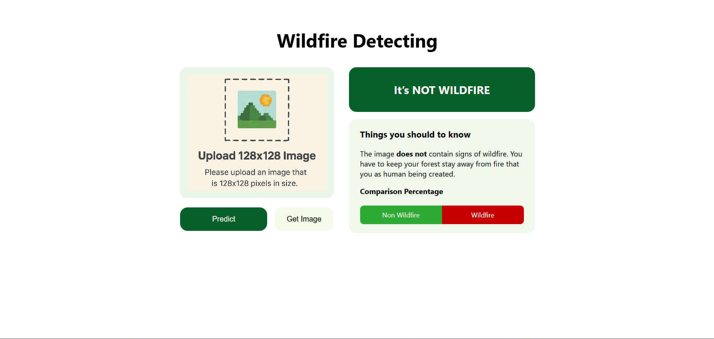

# 🔥 Wildfire Detecting App 🌲

A simple yet powerful **Flask web application** that uses a deep learning model to detect the presence of **wildfires** in uploaded satellite images. Designed for quick deployment and intuitive usage.


---

## 🚀 Features

- 📸 Upload satellite image via browser
- 🔥 Detect wildfire presence with AI model
- 📊 Display **prediction results** and **confidence score**
- 📈 Visual progress bar for intuitive output
- 🧠 Built with TensorFlow/Keras & Flask

---

## 📂 Dataset

We use the [Wildfire Prediction Dataset](https://www.kaggle.com/datasets/abdelghaniaaba/wildfire-prediction-dataset) from Kaggle, which contains labeled satellite imagery for training wildfire detection models.

---

## 🧠 Model

The model is a custom **Convolutional Neural Network (CNN)** trained to classify images into:
- ✅ **Wildfire Detected**
- ❌ **No Wildfire**

Saved model file:  
`model/wildfire_classification_model.h5`

---

## 🛠️ Installation & Running the App

### 1. Clone the Repository
```bash
git clone https://github.com/yourusername/wildfire-monitoring.git
cd wildfire-monitoring
```

### 2. Install Dependencies
```bash
pip install -r requirement.txt
```

### 3. Run the Flask App
```bash
python app.py
```

### 4. Access the App
```bash
Visit your browser at:
http://127.0.0.1:5000
```

## 📁 Project Structure
```bash
wildfire_monitoring/
├── model/
│   ├── proyekuas_cv_farrasfajarhadi.pdf      # Project document/report
│   └── wildfire_classification_model.h5      # Trained CNN model
│
├── static/
│   ├── uploads/                               # Directory for uploaded images
│   ├── forest.jpg                             # Sample image
│   ├── input.png                              # UI element image
│   └── styles.css                             # Styling for the web interface
│
├── templates/
│   ├── index.html                             # Main page (image upload)
│   └── result.html                            # Prediction result page
│
├── app.py                                     # Flask backend logic
├── Readme.md                                  # Project documentation
├── .gitignore                                 # Git ignore config
└── requirement.txt                            # Python dependencies
```

## 📸 Example Prediction Output

Upload a sample satellite image and get instant prediction:
```bash
Prediction: 🔥 Wildfire Detected  
Confidence: 92.8%
```
Progress bar and color-coded output displayed on result page.


## 🧑‍💻 Contributing
Contributions, suggestions, and issues are welcome! <br/>
Feel free to fork this repository, open a pull request, or raise an issue.

## 🙏 Acknowledgements
- Wildfire Dataset - Kaggle
- TensorFlow & Keras
- Flask Framework
- Open source tools & community ❤️

---
Made by 🔥 Hitoshi
